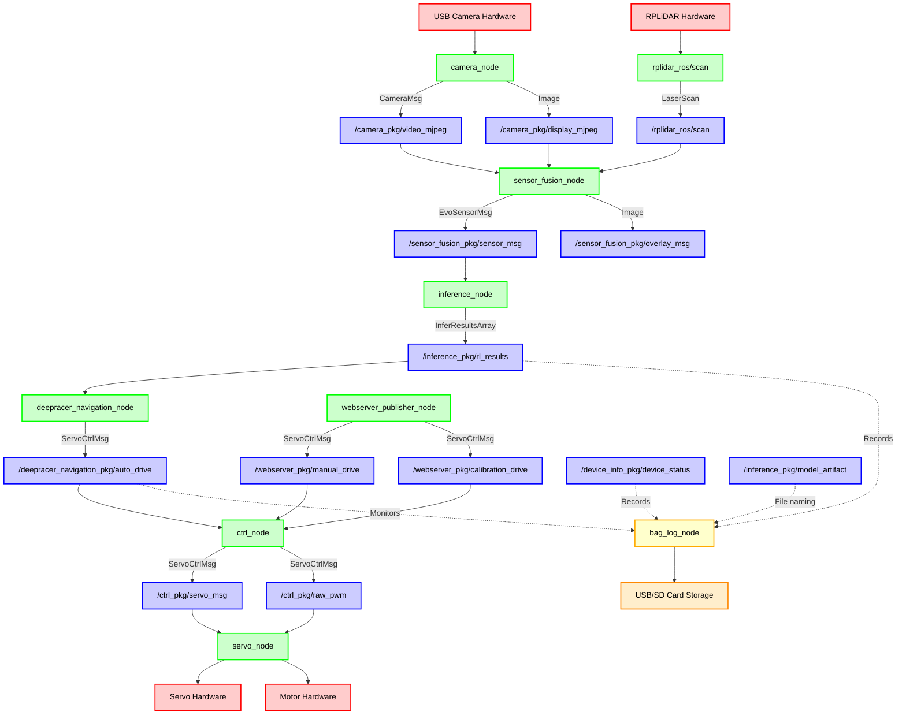

# AWS DeepRacer ROS Data Flow Diagram

Here's the main data flow from camera to servo, showing all the key ROS nodes, publishers, and subscribers:

## Data Flow Description

### 1. **Sensor Input Layer**
- **Camera Hardware** → **camera_node**: Captures video frames from USB cameras
- **RPLiDAR Hardware** → **rplidar_ros**: Captures LiDAR scan data

### 2. **Sensor Processing Layer**
- **camera_node** publishes:
  - `/camera_pkg/video_mjpeg` (CameraMsg): Single/stereo camera images for inference
  - `/camera_pkg/display_mjpeg` (Image): Display images for UI

### 3. **Sensor Fusion Layer**
- **sensor_fusion_node** subscribes to:
  - `/camera_pkg/video_mjpeg` (camera images)
  - `/camera_pkg/display_mjpeg` (display images)
  - `/rplidar_ros/scan` (LiDAR data)
- **sensor_fusion_node** publishes:
  - `/sensor_fusion_pkg/sensor_msg` (EvoSensorMsg): Combined camera + LiDAR data
  - `/sensor_fusion_pkg/overlay_msg` (Image): LiDAR overlay visualization

### 4. **AI Inference Layer**
- **inference_node** subscribes to:
  - `/sensor_fusion_pkg/sensor_msg` (combined sensor data)
- **inference_node** publishes:
  - `/inference_pkg/rl_results` (InferResultsArray): AI model predictions

### 5. **Navigation Layer**
- **deepracer_navigation_node** subscribes to:
  - `/inference_pkg/rl_results` (AI predictions)
- **deepracer_navigation_node** publishes:
  - `/deepracer_navigation_pkg/auto_drive` (ServoCtrlMsg): Autonomous driving commands

### 6. **Control Layer**
- **ctrl_node** (state manager) subscribes to:
  - `/deepracer_navigation_pkg/auto_drive` (autonomous mode)
  - `/webserver_pkg/manual_drive` (manual mode)
  - `/webserver_pkg/calibration_drive` (calibration mode)
- **ctrl_node** publishes:
  - `/ctrl_pkg/servo_msg` (ServoCtrlMsg): Processed servo commands
  - `/ctrl_pkg/raw_pwm` (ServoCtrlMsg): Raw PWM values for calibration

### 7. **Actuation Layer**
- **servo_node** subscribes to:
  - `/ctrl_pkg/servo_msg` (servo commands)
  - `/ctrl_pkg/raw_pwm` (raw PWM commands)
- **servo_node** controls:
  - **Servo Hardware**: Steering control
  - **Motor Hardware**: Throttle control

### 8. **Data Logging Layer**
- **bag_log_node** (from logging_pkg) monitors and records:
  - `/inference_pkg/rl_results` (InferResultsArray): AI inference results for analysis
  - `/device_info_pkg/device_status`: Device status and telemetry data
  - `/deepracer_navigation_pkg/auto_drive` (monitored): Triggers recording during autonomous mode
  - `/inference_pkg/model_artifact`: Used for naming recorded bag files
- **bag_log_node** outputs to:
  - **USB/SD Card Storage**: ROS bag files saved to `/opt/aws/deepracer/logs`

**Logging Behavior:**
- Records only during autonomous mode ("Start Vehicle")
- Creates new bag files if model changes or after 15-second idle timeout
- Appends to existing bag if restarted within 15 seconds
- Requires USB/SD card with `logs/` folder for automatic mounting

## Key Message Types

- **CameraMsg**: Contains single or stereo camera images
- **LaserScan**: LiDAR distance measurements
- **EvoSensorMsg**: Combined camera + LiDAR sensor data
- **InferResultsArray**: AI model inference results with class probabilities
- **ServoCtrlMsg**: Steering angle and throttle values (-1.0 to 1.0)
- **Image**: Standard ROS image messages for display
- **DeviceStatusMsg**: Device telemetry and status information

## Operating Modes

The system operates in three modes controlled by **ctrl_node**:
1. **Autonomous**: Uses AI inference results from the navigation node
2. **Manual**: Uses commands from the web server interface
3. **Calibration**: Uses raw PWM values for servo calibration

## Hardware Components

- **USB Cameras**: Single or stereo camera setup
- **RPLiDAR**: Optional LiDAR sensor for obstacle detection
- **Servo Motor**: Controls steering
- **DC Motor**: Controls throttle/speed
- **USB/SD Card**: Storage for ROS bag logging during autonomous operation
