# AWS DeepRacer ROS Service Call Diagram

This document shows the main ROS service calls in the AWS DeepRacer system, focusing on service servers, clients, and their interactions across different nodes.

```mermaid
graph TD
    %% Web Server Node (Service Clients)
    WebServerNode[webserver_publisher_node]
    
    %% Control Node (Service Server & Client)
    CtrlNode[ctrl_node]
    
    %% Servo Node (Service Server)
    ServoNode[servo_node]
    
    %% Camera Node (Service Server)
    CameraNode[camera_node]
    
    %% Inference Node (Service Server)
    InferenceNode[inference_node]
    
    %% Navigation Node (Service Server)
    NavigationNode[deepracer_navigation_node]
    
    %% Sensor Fusion Node (Service Server)
    SensorFusionNode[sensor_fusion_node]
    
    %% Model Optimizer Node (Service Server)
    ModelOptimizerNode[model_optimizer_node]
    
    %% Device Info Node (Service Server)
    DeviceInfoNode[device_info_node]
    
    %% Status LED Node (Service Server)
    StatusLedNode[status_led_node]
    
    %% Individual DeepRacer Systems Package Nodes (Service Servers)
    SoftwareUpdateNode[software_update_node]
    ModelLoaderNode[model_loader_node] 
    OTGControlNode[otg_control_node]
    NetworkMonitorNode[network_monitor_node]
    SystemsScriptsNode[deepracer_systems_scripts_node]
    
    %% USB Monitor Node (Service Server)
    USBMonitorNode[usb_monitor_node]
    
    %% Bag Log Node (Service Server & Client)
    BagLogNode[bag_log_node]
    
    %% Vehicle Control Services (WebServer -> CtrlNode)
    WebServerNode -.->|ActiveStateSrv| CtrlNode
    WebServerNode -.->|EnableStateSrv| CtrlNode
    WebServerNode -.->|GetCtrlModesSrv| CtrlNode
    
    %% Calibration Services (WebServer -> CtrlNode -> ServoNode)
    WebServerNode -.->|GetCalibrationSrv| CtrlNode
    WebServerNode -.->|SetCalibrationSrv| CtrlNode
    CtrlNode -.->|GetCalibrationSrv| ServoNode
    CtrlNode -.->|SetCalibrationSrv| ServoNode
    CtrlNode -.->|ServoGPIOSrv| ServoNode
    
    %% LED Control Services (WebServer -> CtrlNode -> ServoNode)
    WebServerNode -.->|GetLedCtrlSrv| CtrlNode
    WebServerNode -.->|SetLedCtrlSrv| CtrlNode
    CtrlNode -.->|GetLedCtrlSrv| ServoNode
    CtrlNode -.->|SetLedCtrlSrv| ServoNode
    
    %% Camera Services (CtrlNode -> CameraNode)
    CtrlNode -.->|VideoStateSrv| CameraNode
    
    %% Model Management Services (WebServer -> ModelLoaderNode)
    WebServerNode -.->|ConsoleModelActionSrv| ModelLoaderNode
    WebServerNode -.->|ModelStateSrv| CtrlNode
    WebServerNode -.->|GetModelLoadingStatusSrv| CtrlNode
    WebServerNode -.->|VerifyModelReadySrv| ModelLoaderNode
    
    %% Inference Services (CtrlNode -> InferenceNode)
    CtrlNode -.->|LoadModelSrv| InferenceNode
    CtrlNode -.->|InferenceStateSrv| InferenceNode
    
    %% Navigation Services (CtrlNode -> NavigationNode)
    CtrlNode -.->|LoadModelSrv| NavigationNode
    CtrlNode -.->|NavThrottleSrv| NavigationNode
    WebServerNode -.->|NavThrottleSrv| NavigationNode
    
    %% Model Optimization Services (CtrlNode -> ModelOptimizerNode)
    CtrlNode -.->|ModelOptimizeSrv| ModelOptimizerNode
    
    %% Device Information Services (WebServer -> DeviceInfoNode)
    WebServerNode -.->|GetDeviceInfoSrv| DeviceInfoNode
    WebServerNode -.->|BatteryLevelSrv| DeviceInfoNode
    WebServerNode -.->|SensorStatusCheckSrv| DeviceInfoNode
    
    %% USB Services (ModelLoader/SoftwareUpdate/NetworkMonitor/BagLog -> USBMonitorNode)
    ModelLoaderNode -.->|USBFileSystemSubscribeSrv| USBMonitorNode
    ModelLoaderNode -.->|USBMountPointManagerSrv| USBMonitorNode
    SoftwareUpdateNode -.->|USBFileSystemSubscribeSrv| USBMonitorNode
    SoftwareUpdateNode -.->|USBMountPointManagerSrv| USBMonitorNode
    NetworkMonitorNode -.->|USBFileSystemSubscribeSrv| USBMonitorNode
    NetworkMonitorNode -.->|USBMountPointManagerSrv| USBMonitorNode
    BagLogNode -.->|USBFileSystemSubscribeSrv| USBMonitorNode
    BagLogNode -.->|USBMountPointManagerSrv| USBMonitorNode
    
    %% Software Update Services (WebServer -> SoftwareUpdateNode)
    WebServerNode -.->|SoftwareUpdateCheckSrv| SoftwareUpdateNode
    WebServerNode -.->|BeginSoftwareUpdateSrv| SoftwareUpdateNode
    WebServerNode -.->|SoftwareUpdateStateSrv| SoftwareUpdateNode
    
    %% LiDAR Configuration Services (WebServer -> SensorFusionNode)
    WebServerNode -.->|LidarConfigSrv| SensorFusionNode
    
    %% Status LED Services (WebServer -> StatusLedNode)
    WebServerNode -.->|SetStatusLedSolidSrv| StatusLedNode
    WebServerNode -.->|SetStatusLedBlinkSrv| StatusLedNode
    
    %% OTG Services (WebServer -> OTGControlNode)
    WebServerNode -.->|OTGLinkStateSrv| OTGControlNode
    
    %% Logging Services (External Control -> BagLogNode)
    ExternalClient[External Client] -.->|StopLoggingSrv| BagLogNode
    
    %% Styling
    classDef webNode fill:#ffeecc,stroke:#ff8800,stroke-width:2px,color:#000000
    classDef controlNode fill:#ccffcc,stroke:#00aa00,stroke-width:3px,color:#000000
    classDef serviceNode fill:#ccccff,stroke:#0000ff,stroke-width:2px,color:#000000
    classDef hardwareNode fill:#ffcccc,stroke:#ff0000,stroke-width:2px,color:#000000
    
    class WebServerNode,ExternalClient webNode
    class CtrlNode controlNode
    class ServoNode,CameraNode,InferenceNode,NavigationNode,SensorFusionNode,ModelOptimizerNode,DeviceInfoNode,StatusLedNode,SoftwareUpdateNode,ModelLoaderNode,OTGControlNode,NetworkMonitorNode,SystemsScriptsNode,USBMonitorNode,BagLogNode serviceNode
```

## Service Call Categories

### 1. **Vehicle Control Services**
Controls the vehicle's operational state and modes.

#### **WebServer → CtrlNode**
- **`/ctrl_pkg/vehicle_state`** (ActiveStateSrv): Switch between manual/autonomous/calibration modes
- **`/ctrl_pkg/enable_state`** (EnableStateSrv): Start/stop the vehicle
- **`/ctrl_pkg/get_ctrl_modes`** (GetCtrlModesSrv): Get available control modes

### 2. **Calibration Services**
Manages servo/motor calibration values and GPIO control.

#### **WebServer → CtrlNode → ServoNode**
- **`/ctrl_pkg/get_car_cal`** → **`/servo_pkg/get_calibration`** (GetCalibrationSrv): Retrieve calibration values
- **`/ctrl_pkg/set_car_cal`** → **`/servo_pkg/set_calibration`** (SetCalibrationSrv): Set calibration values
- **CtrlNode → ServoNode**: **`/servo_pkg/servo_gpio`** (ServoGPIOSrv): Enable/disable servo GPIO

### 3. **LED Control Services**
Controls the vehicle's LED states and colors.

#### **WebServer → CtrlNode → ServoNode**
- **`/ctrl_pkg/get_car_led`** → **`/servo_pkg/get_led_state`** (GetLedCtrlSrv): Get LED PWM values
- **`/ctrl_pkg/set_car_led`** → **`/servo_pkg/set_led_state`** (SetLedCtrlSrv): Set LED colors/patterns

### 4. **Camera Services**
Manages camera activation and streaming.

#### **CtrlNode → CameraNode**
- **`/camera_pkg/media_state`** (VideoStateSrv): Start/stop camera streaming

### 5. **Model Management Services**
Handles AI model loading, optimization, and management.

#### **WebServer → ModelLoaderNode**
- **`/model_optimizer_pkg/console_model_action`** (ConsoleModelActionSrv): Upload/delete models
- **`/model_optimizer_pkg/verify_model_ready`** (VerifyModelReadySrv): Verify model readiness

#### **WebServer → CtrlNode**
- **`/ctrl_pkg/model_state`** (ModelStateSrv): Load specific model
- **`/ctrl_pkg/is_model_loading`** (GetModelLoadingStatusSrv): Check loading status

#### **CtrlNode → InferenceNode**
- **`/inference_pkg/load_model`** (LoadModelSrv): Load model for inference
- **`/inference_pkg/inference_state`** (InferenceStateSrv): Control inference state

#### **CtrlNode → NavigationNode**
- **`/deepracer_navigation_pkg/load_action_space`** (LoadModelSrv): Load action space for navigation

#### **CtrlNode → ModelOptimizerNode**
- **`/model_optimizer_pkg/model_optimizer_server`** (ModelOptimizeSrv): Optimize model for inference

### 6. **Navigation Services**
Controls autonomous navigation behavior.

#### **WebServer/CtrlNode → NavigationNode**
- **`/deepracer_navigation_pkg/navigation_throttle`** (NavThrottleSrv): Set maximum throttle for autonomous mode

### 7. **Device Information Services**
Provides device status and telemetry information.

#### **WebServer → DeviceInfoNode**
- **`/device_info_pkg/get_device_info`** (GetDeviceInfoSrv): Get device information
- **`/device_info_pkg/get_battery_level`** (BatteryLevelSrv): Get battery level
- **`/device_info_pkg/get_sensor_data_status`** (SensorStatusCheckSrv): Check sensor status

### 8. **USB Services**
Manages USB device detection and mounting.

#### **ModelLoaderNode/SoftwareUpdateNode/NetworkMonitorNode/BagLogNode → USBMonitorNode**
- **`/usb_monitor_pkg/usb_file_system_subscribe`** (USBFileSystemSubscribeSrv): Subscribe to file notifications for models/updates/config/logs
- **`/usb_monitor_pkg/usb_mount_point_manager`** (USBMountPointManagerSrv): Manage mount points

### 9. **Software Update Services**
Handles system software updates.

#### **WebServer → SoftwareUpdateNode**
- **`/systems_pkg/software_update_check`** (SoftwareUpdateCheckSrv): Check for updates
- **`/systems_pkg/begin_software_update`** (BeginSoftwareUpdateSrv): Start update process
- **`/systems_pkg/software_update_state`** (SoftwareUpdateStateSrv): Get update status

### 10. **LiDAR Configuration Services**
Configures LiDAR sensor settings.

#### **WebServer → SensorFusionNode**
- **`/sensor_fusion_pkg/configure_lidar`** (LidarConfigSrv): Configure LiDAR parameters

### 11. **Status LED Services**
Controls system status LEDs.

#### **WebServer → StatusLedNode**
- **`/status_led_pkg/set_status_led_solid`** (SetStatusLedSolidSrv): Set solid LED status
- **`/status_led_pkg/set_status_led_blink`** (SetStatusLedBlinkSrv): Set blinking LED status

### 12. **OTG Services**
Manages On-The-Go USB connections.

#### **WebServer → OTGControlNode**
- **`/systems_pkg/otg_link_state`** (OTGLinkStateSrv): Control OTG link state

### 13. **Logging Services**
Controls data recording and rosbag management.

#### **External Client → BagLogNode**
- **`/logging_pkg/stop_logging`** (Trigger): Stop data recording and close rosbag file

## Key Service Message Types

### **Request/Response Patterns**

- **ActiveStateSrv**: Request mode change (manual/autonomous/calibration) → Response with error code
- **EnableStateSrv**: Request start/stop → Response with error code  
- **GetCalibrationSrv**: Request calibration type → Response with min/mid/max/polarity values
- **SetCalibrationSrv**: Request calibration values → Response with error code
- **LoadModelSrv**: Request model path and parameters → Response with error code
- **VideoStateSrv**: Request camera activation → Response with error code
- **BatteryLevelSrv**: Request battery info → Response with battery level
- **NavThrottleSrv**: Request throttle limit → Response with error code
- **Trigger**: Request action (empty) → Response with success flag and message

## Service Flow Patterns

### **Multi-hop Service Calls**
Some web API calls trigger multiple service calls in sequence:

1. **Calibration Control**: WebServer → CtrlNode → ServoNode
2. **LED Control**: WebServer → CtrlNode → ServoNode  
3. **Model Loading**: WebServer → CtrlNode → InferenceNode/NavigationNode
4. **Vehicle Mode Change**: WebServer → CtrlNode → (Camera/Inference/Navigation)

### **Service Client Patterns**
- **Synchronous calls**: Most services use `call_service_sync()` with timeout
- **Error handling**: All services return error codes for validation
- **Service readiness**: Clients wait for service availability before calling
- **Callback groups**: Services use different callback groups for concurrent execution

## Node Service Responsibilities

### **webserver_publisher_node** (Service Client Only)
- Provides REST API interface for web console
- Calls services on behalf of web interface
- Handles service timeouts and error responses

### **ctrl_node** (Service Server & Client)
- **Server**: Provides vehicle control and configuration services
- **Client**: Orchestrates calls to hardware and processing nodes
- **State Management**: Manages vehicle operational modes

### **servo_node** (Service Server Only)
- Provides calibration and LED control services
- Directly interfaces with servo/motor hardware
- Manages PWM values and GPIO control

### **Other Nodes** (Service Server Only)
- **camera_node**: Camera control services
- **inference_node**: Model loading and inference control
- **deepracer_navigation_node**: Action space and navigation services
- **sensor_fusion_node**: LiDAR configuration services
- **device_info_node**: Device status and telemetry services
- **status_led_node**: LED control services
- **software_update_node**: Software update management services
- **model_loader_node**: Model verification and console management services
- **otg_control_node**: USB OTG connection control services
- **network_monitor_node**: Network status monitoring (publishes topics)
- **deepracer_systems_scripts_node**: Background system script execution

### **bag_log_node** (Service Server & Client)
- **Server**: Provides logging control services (stop recording)
- **Client**: Uses USB monitoring services for storage path detection
- **Data Recording**: Records inference results and vehicle control topics to rosbag files

## DeepRacer Systems Package Architecture

The `deepracer_systems_pkg` contains multiple specialized nodes that handle system-level functionality:

- **`software_update_node`**: Manages software package updates, handles update checks, execution, and status reporting
- **`model_loader_node`**: Handles model loading from USB, model verification, console model operations, and model management
- **`otg_control_node`**: Controls Ethernet-over-USB (OTG) functionality for host connections
- **`network_monitor_node`**: Monitors network connectivity and publishes network status (no services, only topics)
- **`deepracer_systems_scripts_node`**: Runs background dependency scripts and system maintenance tasks

These nodes work together to provide comprehensive system management, replacing what was previously represented as a single "systems_node" placeholder.

## Error Handling and Reliability

### **Service Availability**
- All clients use `wait_for_service()` to ensure service readiness
- Timeout-based service calls prevent hanging
- Graceful degradation when services are unavailable

### **Error Propagation**
- Services return standardized error codes
- Multi-hop calls propagate errors back to web interface
- Logging at each service level for debugging

### **Concurrent Service Calls**
- Callback groups enable concurrent service handling
- Reentrant callback groups for multiple simultaneous calls
- Mutually exclusive groups for hardware access serialization
